>[Return to homepage](index.md)
# Lab 1 Report
### Hello!
This page will serve as a tutorial and summarization of Lab 1 for this course. I will be documenting my process of completing this lab below.
## Installing VSCode
To install VSCode, simply navigate to their website which should bring you to this page:

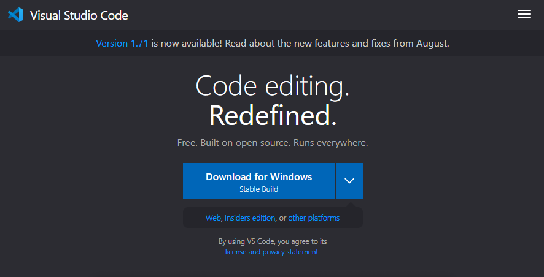

Simply download the executable specific to your computer's operating system and follow the install instructions. When complete, Opening VSCode should bring you to this startup page:

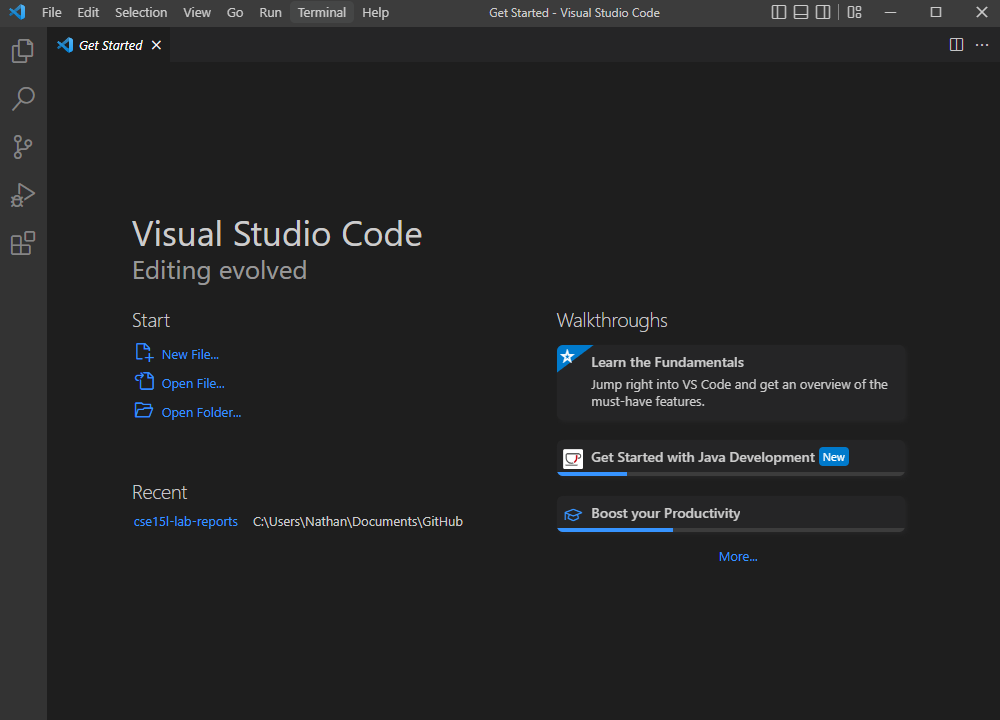

## Remotely Connecting
To begin the remote connection setup, first install SSH on your computer by following these steps:
* Open Settings on your computer
* Click on 'Apps' and then 'Optional Features'
* Search 'SSH' and click 'Install'

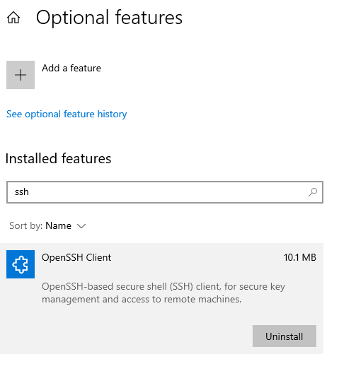

After installing SSH, Open a new terminal on VSCode. To connect to the remote server, input this command:

> `ssh cs15lfa22$$@ieng6.ucsd.edu`
* '$$' should be replaced with the two letters corresponding to your course-specific account name.

Then input your password when prompted. After the connection has been established, your terminal should have the following output:

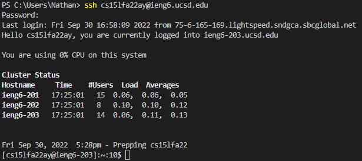

If you are having trouble finding your account name or need to reset your password, go here:

 https://sdacs.ucsd.edu/~icc/index.php
 
 This will take you to the UCSD website where you can search up your course-specific username and reset your password.

## Trying Some Commands
 Now that you are connected to the remote server, you will be able to run commands remotely by simply inputting them into the terminal. Running commands such as `ls`, `cd`, `pwd`, `mkdir` are shown below:

 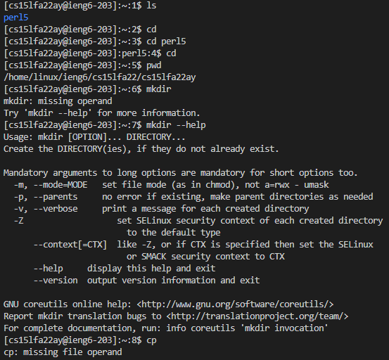
* Note that when running `ls` only the `perl5` directory is present on the remote computer.

Then try running the same commands locally as well. Run the command `exit` to disconnect from the remote server. Below are commands run on my local computer:

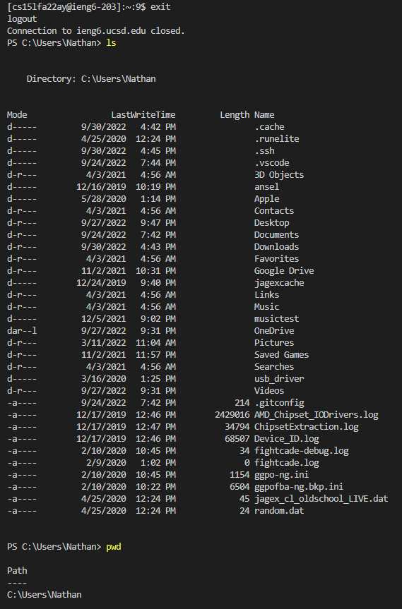
* Here, `ls` is ran on my local computer, hence 'perl5' is not the only directory, but instead all the directories present on my local computer.

## Moving Files With `scp`
The command `scp` will copy files from your computer to a remote computer. 

To demo this command, we will create a file on the local computer called `WhereAmI.java` that will output the os, username, user home directory, and current directory of the file.

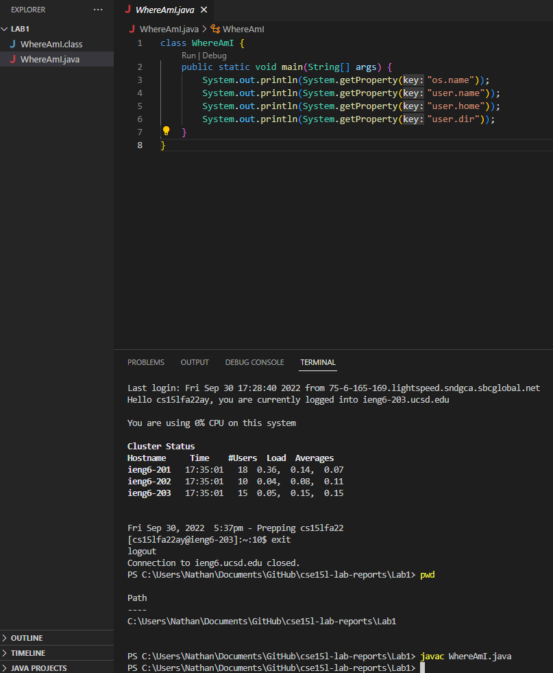

Compile and run the `WhereAmI` program using the `javac` and `java` commands in the terminal

> `javac WhereAmI.java` \
`java WhereAmI`

This should create a class file for the program and output the results into the terminal:

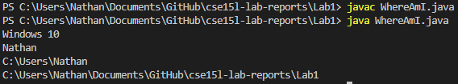

Then, in the terminal **from the directory where you made this file**, run this scp command and enter your password when prompted:

> `scp WhereAmI.java cs15lfa22$$@ieng6.ucsd.edu:~/`

Now, connect to the remote server and run `ls`. You should see the new file `WhereAmI` there!

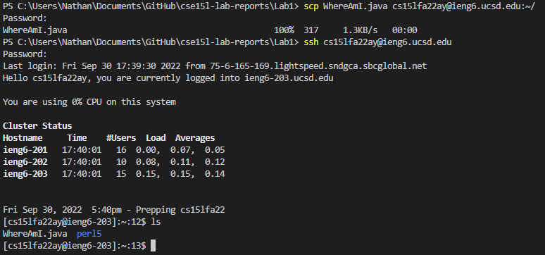

Now you can try running the program on the *ieng6 computer* using the same `javac` and `java` commands as above.

## SSH Keys
Lastly, we will use a program called `ssh-keygen` to set up an SSH key as to bypass password input every time we connect to the remote server.

Follow the inputs in the image below to set this up:

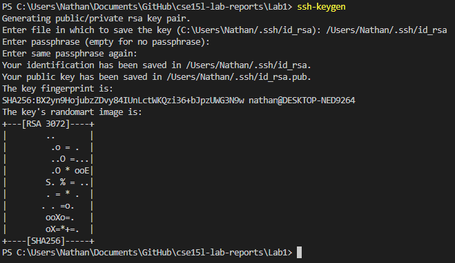

After this setup, connect to the remote server and follow these commands:

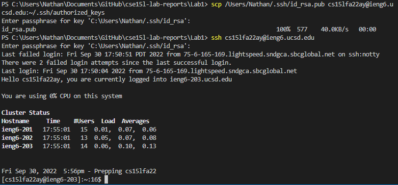

After this, you will only need to input the key that you entered to connect to the remote server!

## Making Remote Running Even More Pleasant

Using what we have learned, we are able to recall and combine commands in the terminal to reduce the amount of keystrokes needed to optimize the process of copying and running programs in the remote server.

Techniques used include:
* running several commands in one line
* recalling commans using the up-arrow key
* running commands in quotes at the end of an `ssh` command to directly run it on the remote server

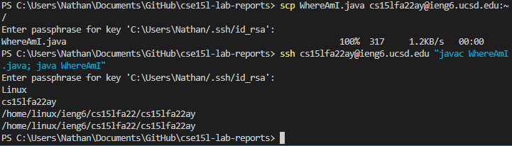

Above is my optimized process. With the commands `scp WhereAmI.java cs15lfa22$$@ieng6.ucsd.edu:~/` and `ssh cs15lfa22$$@ieng6.ucsd.edu "javac WhereAmI.java; java WhereAmI"` already ran in the terminal, we are able to get the process under 10 total keystrokes:

1) up-arrow key to `ssh ...`
2) up-arrow key to `scp ...`
3) enter key
4) up-arrow key to `scp ...`
5) up-arrow key to `ssh ...`
6) enter key

This process doesnt account for certain machines where passwords or passphrases must be entered -- see above section on `ssh keys` to solve.

### That's it for this lab report, I hope this is helpful. 

### - Nathan

>[Return to homepage](index.md)
