>[Return to homepage](index.md)
# Lab 2 Report
### Hello!
This page will serve as a summarization of Lab 2 for this course. I will be documenting my process of completing this lab below.

## Part 1 - Search Engine
Below is my codeblock for SearchEngine.java, a program that functions on a server to retain a list of words that can receive both amendments and search queries:

~~~
import java.io.IOException;
import java.net.URI;
import java.util.ArrayList;

class Handler implements URLHandler 
{
    // The one bit of state on the server: a number that will be manipulated by
    // various requests.
    ArrayList<String> word = new ArrayList<String>();
    String s1 = "Default";
    
    public String handleRequest(URI url) 
    {
        String list = "Words: \n";
        if (url.getPath().equals("/")) 
        {
            for(int i = 0; i < word.size(); i++)
            {
                String curr = word.get(i);
                list += "\n" + curr;
            }
            return list;
        } 
        else 
        {
            System.out.println("Path: " + url.getPath());
            if (url.getPath().contains("/add")) 
            {
                String[] parameters = url.getQuery().split("=");
                if (parameters[0].equals("s")) 
                {
                    word.add(parameters[1]);
                    return String.format("Word added!"); //use stringformat
                }
            }
            else 
            {
                System.out.println("Path: " + url.getPath());
                if (url.getPath().contains("/search")) 
                {
                    String searchResult = "";
                    String[] para = url.getQuery().split("=");
                    if (para[0].equals("s")) 
                    {
                        String searchInput = para[1];
                        for (int i = 0; i < word.size(); i++)
                        {
                            if (word.get(i).contains(searchInput))
                            {
                                System.out.println(word.get(i));
                                searchResult += String.format(word.get(i) + "\n");
                            }
                        }
                    }
                    return String.format(searchResult +"\nSearch Complete!");
                }
            }
            return "404 Not Found!";
        }
    }
}

class SearchEngine {
    public static void main(String[] args) throws IOException 
    {
        if(args.length == 0)
        {
            System.out.println("Missing port number! Try any number between 1024 to 49151");
            return;
        }

        int port = Integer.parseInt(args[0]);

        Server.start(port, new Handler());
    }
}
~~~

The program utilizes a URL handler to process arguments and queries. When first initializing the program and visiting the localhost, you are greeted with an empty ArrayList of words:

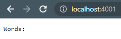

`SearchEngine.java` will perform actions by handling the path of the url, such as the screenshot below:

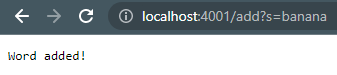

The search engine checks the path for `add`, splitting the parameter between `s` and the word to be added. The parameter is then added to the ArrayList of words using a simple `.add(parameter)`, and a message stating the word has been added is returned and displayed on screen.

After adding a few words to the list, the current list can be checked by using the path `/`.

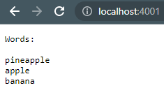

The `/` path will concatenate all the members of the `word` ArrayList to a string and return it to be displayed on screen. 

If the user wishes to search for specific words to be displayed, they can use the `search` path:

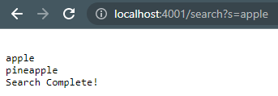

Like with the `add` path, the URL handler will check for the `search` path and split the parameter, storing the search input. The search engine will then initiate a loop that will check for any words in the `word` ArrayList that contain the search parameter. If words do contain the parameter, they are concatenated to a new string which is then returned to be displayed on screen. 

In the above screenshot, the search paramter is 'apple', so the words 'apple' and 'pineapple' are concatenated and returned as they both contain the search parameter.

## Part 2 - Bug Fixes

We will go over two examples of programs that contain bugs. For each of these, we will describe:

* Failure-inducing input
* Symptoms
* The Bug
* Connection between the symptom and the bug

### Method 1 - `reversed`

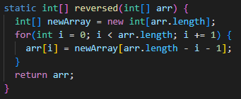

The first method is `reversed`. Its purpose is to return a new array with all the elements in reverse order.

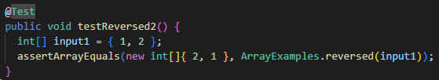

Above is the input that causes the method to fail. The elements `1 , 2` should reverse to `2 , 1`.

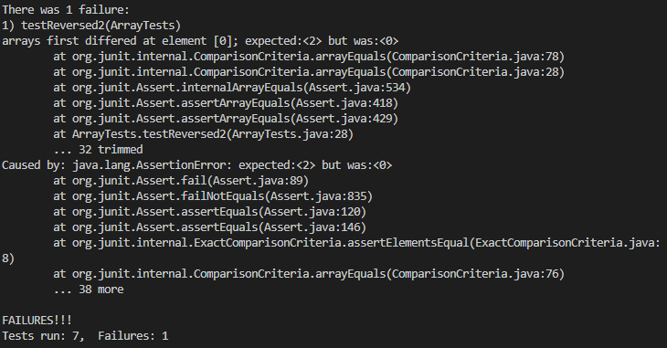

As shown above, the symptom -- or failing test output -- was a failure to return an array with the elements reversed. instead of `2` at `index[0]`, the actual element was `0`.

This symptom was caused by the following bug:

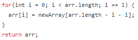

`newArray` is never initialized with values, so when setting the elements of `arr` equal to `newArray`, the values fail to reverse.

Instead, the line of code should read 
~~~
newArray[i] = arr[arr.length - i - 1];
~~~
This way, the elements of the input `arr` will be set in `newArray` in reverse order.
To complete the bug fix, we will also return `newArray` instead of `arr`.

### Method 2 - `merge`

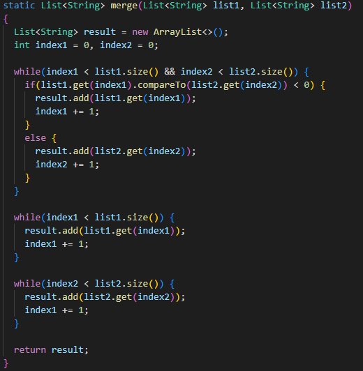

Above is the method `merge` which has the purpose of taking two sorted `lists` and combining them into one sorted `list`.

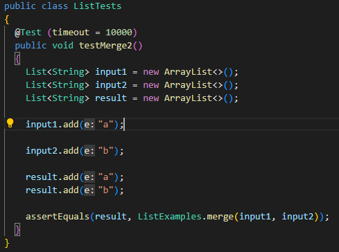

The above shows a failure-inducing input. The two lists `input1` and `input2` should result in the `result` list with the elements sorted `"a" , "b"`.

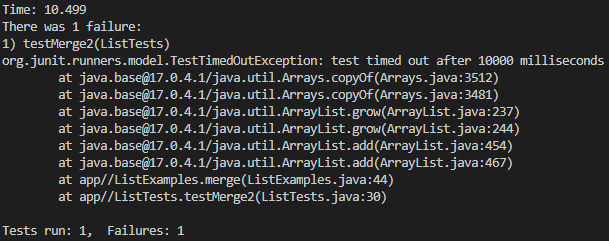

This input creates the symptom of an infinite-loop. The test only ceases when 10000 milliseconds pass.

This loop is caused by the following line of code:

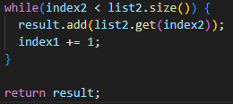

~~~
index1 += 1;
//should instead be
index2 += 1;
~~~
incrementing `index1` does nothing in the context of the loop. By failing to increment `index2`, the cease condition is never met, and the loop continues infinitely.

### That's it for this lab report, I hope this is helpful. 

### - Nathan

>[Return to homepage](index.md)
