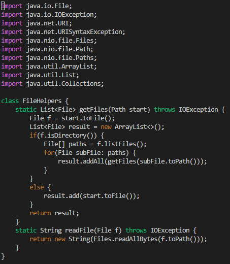
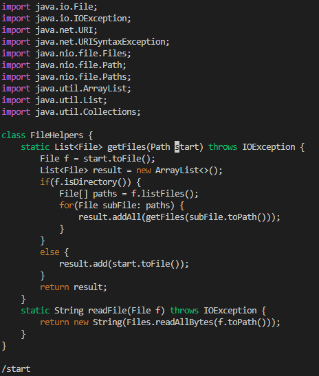
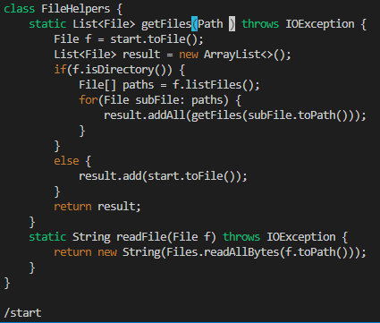
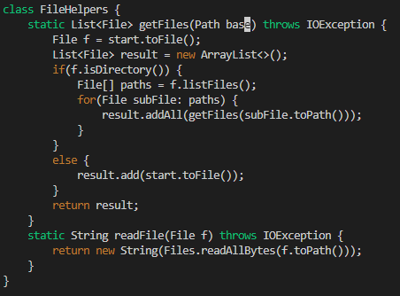
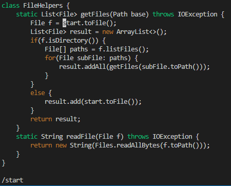
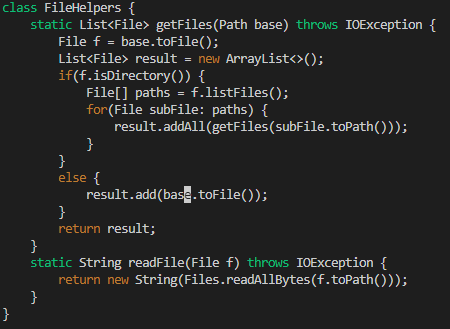

>[Return to homepage](index.md)
# Lab Report 4
### Hello!
This page will serve as a report for Week 6 of cse15L.

## Part 1 - Editing a file with `vim`
`vim` is a very useful text editor that utilizes only the keyboard. In this lab we took code from the skill demonstration and performed the proper fixes to them using `vim` instead of our traditional techniques. The main task I worked on was:

### Changing the name of the `start` parameter and its uses to `base`
Here is the shortest sequence of commands to perform this task that we found during the lab: \
~~~
/start<Enter>dwibase<Esc>ndwibase<Esc>ndwibase<Esc>:w<Enter>
~~~
This sequence exceeds 30 keystrokes -- finding a command that would perform the `dwibase` pattern for all instances of `start` at the same time will easily get it under 30 keystrokes.

### Initial Code

This is the codeblock before any changes are made using `vim`. The cursor begins at the top left corner.

### `/start<Enter>`

`/start` will search for the first appearance of the string 'start' and then `<Enter>` will jump to it.

### `dw`

`d` is a key that deletes text from the code. pairing it with `w`, which jumps one word forward, will delete one whole word. Here, `dw` is used to delete the word `start`, which we navigated to in the previous step.

### `ibase<Esc>`

`i` will enter `insert mode` where keystrokes change from commands to simply entering text to the codeblock. Entering `base` will input the word where `start` was deleted, and pressing `<Esc>` exits `insert mode`.

### `n`

The `n` command jumps to the next instance of the previously executed `/` command. Since we searched for `start`, the cursor jumps to the next instance of `start`.

### `dwibase<Esc>` `ndwibase<Esc>`

In this step, the pattern of deleting `start`, replacing it with `base`, is repeated for the final two instances of `start`. To save, or *write* our changes to the file, we run the command: /
### `:w<Enter>`
`:` will tell vim to take the following keystrokes as input for a command instead of running whichever command the keys are tied to (for `default mode` in `vim`). `<Enter>` inputs the `:w`, or `write` command to finalize our changes.

## Part 2 - Traditional Method vs. `vim`
For the next part of this lab, I have timed myself completing the task above using both traditional editing methods, and then using the one detailed above. My times were:

### 00:44 `vim`
### 01:11 Traditional

I believe I would prefer `vim` to work on a program I am running remotely, if I were more experienced with the tool. Text edits, not having to log in and out of remote servers, and not having to copy files from local to remote computers saves a great deal of time. The greatest factor into my decision is my experience and clumsiness handling the tool. I believe it will take longer for me to adapt to `vim` and use it as effectively as I would traditional methods of editing. So for now, I would continue to use traditional methods.

### That's it for this lab report, I hope this is helpful. 

### - Nathan

>[Return to homepage](index.md)
